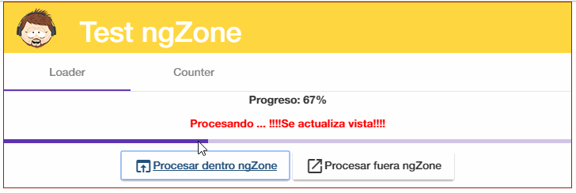
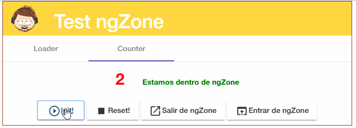

# Test NgZone Angular4

Proyecto generado con [Angular CLI](https://github.com/angular/angular-cli) version 1.0.0-rc.0.

Aplicación para establecer criterios sobre la ngZone de Angular.

## NgZone

Angular tiene su propio contenxto de ejecución (ngZone) y puede detectar cuando cualquier tarea asíncrona empieza o termina dentro de esa zona. Por lo que cualquier tarea que se ejecuta dentro de la ngZone desencadenará un cambio. 
Es decir, para que cualquier cambio desencadene la 'detección de cambios', necesita ser ejecutado dentro de la ngZone.

La primera vez que ejecutamos nuestra aplicación, el se crear el root component, se hace el bootstrap, se crean resto de componentes,todas nuestras funciones constructoras en los componentes se ejecutarán,..... Se establece el estado inicial de la aplicación

Una vez que se determina que el estado inicial de la aplicación, hay algunas maneras que el estado puede cambiar a través de tareas asíncronas, que pueden ser:

eventos: (click),...
Peticiones HTTP: http.post,...
Temporizadores: setTimeout,...
...

Todos ellos pueden causar un cambio en la vista.  
La ngZone se importa del core de angular
```bash
import { NgZone } from '@angular/core';
```
Y se apoya en los métodos ngZone.runOutsideAngular() y ngZone.run()

Se implementan 2 componentes para establecer estos conceptos:

## Demo
Desplegada [aquí](https://angulartraining-ngzone.firebaseapp.com) 

<p align="center"> 
   <span></span> 
</p> 


## Ejemplo1 - Loader
Se trata de un simple loader que muestra por pantalla el progreso. 
Se implementa una función que simular el proceso, incrementando el campo progress de 0 a 100

<p align="center"> 
   <span></span> 
</p> 


```bash
  /**
    * Incrementa this.progress hasta 100 a través de un timeout que la ejecuta recursivamente cada 10 ms
    * @private
    * @param {() => void} doneCallback
    * @memberOf LoaderComponent
    */
    private _increaseProgress(doneCallback: () => void) {
        this.progress += 1;
        console.log(`Progreso actual: ${this.progress}%`);
        if (this.progress < 100) {
            window.setTimeout(() => this._increaseProgress(doneCallback), 10);
        }else {
            doneCallback();
        }
    }
```

### Dentro de la ngZone (progreso se renderiza en la vista)
```bash
   /**
     * Se realiza proceso dentro de la ngZone, con lo que en cada bucle al actualizarse
     * el campo this.progress, se va actualizando en la vista
     * @memberOf LoaderComponent
     */
    processWithinAngularZone() {
        this.zona = 'dentro';
        this.progress = 0;
        this._increaseProgress(() => console.log('Dentro hecho!'));
    }
```
### Fuera de la ngZone (progreso NO se renderiza en la vista, se muestra prograso una vez finalizado loop)
```bash
   /**
     * Se realiza el proceso fuera de la ngZone, con lo que en cada bucle se va actualizando
     * el campo this.progress pero no se va actualizando en la vista al estar fuera.
     * Una vez concluido el proceso se vuelve a sincronizar con la ngZone para bindear this.progress
     * con lo cuál evitamos todos los triggers que están pendientes en la detección de cambios en el dom que Angular2 ejecuta continuamente.
     * @memberOf LoaderComponent
     */
    processOutsideOfAngularZone() {
        this.zona = 'fuera';
        this.progress = 0;
        // runOutsideAngular-> sale de la ngZone para ejecutar el proceso, se ejecutará en paralelo al ctx angular
        this._ngZone.runOutsideAngular(() => {
            this._increaseProgress(() => {
                // esta es la callback que se ejecutará cuando termine. En ese caso volvemos a la ngZone
                this._ngZone.run(() => {
                    console.log('Fuera hecho!' );
                });
            } );
        });
    }

```

## Ejemplo2 - Counter 
Se trata de contador que suma un número en un loop. 

<p align="center"> 
   <span></span> 
</p> 

Este loop se inicializa en la ngZone:
```bash
   /**
     * Función que lanza el contador. Incrementa campo cada seg
     * @memberOf CounterComponent
     */
    init() {
        // Limpia interval activo
        window.clearInterval(this.interval);
        this.interval = window.setInterval(() => {this.contador++; } , 500);
    }
``` 
### Fuera de la ngZone 
Se puede sacar del ctx angular de la siguiente forma

```bash
   **
     * Saca de la ngZone la función contador, con lo que ya no se renderizará
     * el campo en la  vista cada ciclo. No obstante la vble se sigue incrementando.
     * Al volver a entrar en la zona se hará un binding del valor actual del contador a
     * la vista
     * @memberOf CounterComponent
     */
    exitNgZone () {
        this.zone = 'fuera';
        this._ngZone.runOutsideAngular(() => this.init());
    }
``` 
Pero el contador se sigue incrementando aunque fuera de la ngZone, con lo cual estos incrementos no se renderizan en la vista, el ctrol de cambios del ctx NO actuará 

### Dentro de la ngZone 
Se puede entrar de nuevo en el ctx angular de la siguiente forma

```bash
   /**
     * Mete en la ngZone la función contador, con lo que se renderizará, el ctrol de cambios del ctx actuará
     * el campo en la  vista cada ciclo.
     * @memberOf CounterComponent
     */
    enterNgZone () {
        this.zone = 'dentro';
        this._ngZone.run (() => this.init());
    }
``` 
de nuevo el contador volverá a renderizarse en la vista

## Ng-bootstrap
Se utiliza Ng-bootstrap para la vista. [Documentación](https://ng-bootstrap.github.io/#/home)

### Instalación
```bash
npm install --save @ng-bootstrap/ng-bootstrap
```
importar en el módulo principal
```bash
import {NgbModule} from '@ng-bootstrap/ng-bootstrap';

@NgModule({
  declarations: [AppComponent, ...],
  imports: [NgbModule.forRoot(), ...],  
  bootstrap: [AppComponent]
})
export class AppModule {
}
```
Para utilizarlo en el resto de módulos secundarios, no es necesario forRoot
```bash
import {NgbModule} from '@ng-bootstrap/ng-bootstrap';

@NgModule({
  declarations: [OtherComponent, ...],
  imports: [NgbModule, ...]
})
export class OtherModule {
}
```
Este módulo contiene los js para bootstrap (jquery, tether...)
Aún faltaría importar el css de bootstrap, lo importamos desde el mismo cdn dentro del styles.css
```bash
@import '~https://maxcdn.bootstrapcdn.com/bootstrap/3.3.7/css/bootstrap.min.css'; 
```
Se podría descargar o bajar el paquete de bootstrap con npm y añadirlo en styles[] dentro del package.json para que wp lo empaquete

### Generar documentación
Instalación global
```bash
npm install -g @compodoc/compodoc
```
Instalación local
```bash
npm install --save-dev @compodoc/compodoc
```
Definir script en package.json (se añade -a screenshots para llevar la carpeta de screenshots al generado, y el theme)
```bash
"scripts": {
  "compodoc": "./node_modules/.bin/compodoc -p tsconfig.json -a screenshots"
}
```
Lanzar script 
```bash
npm run compodoc
```
Se genera carpeta /documentation

## Deploy firebase
Se crea script en el package.json que borra /dist, genera el build para prod, documentación y despliega en firebase  
```bash
 "deploy-firebase": "del dist && ng build --env=prod --aot && npm run compodoc && move documentation dist && firebase deploy"
```